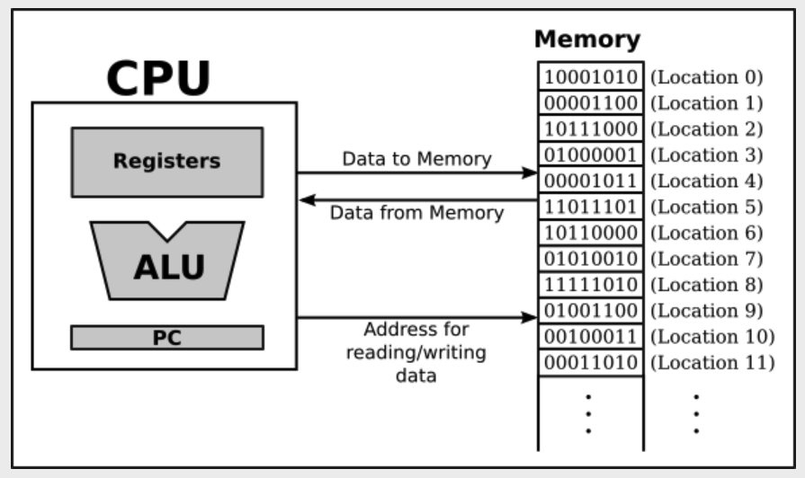

# The Fetch and Execute Cycle: Machine Language

### Program
- 프로그램은 간단하게 말해서 컴퓨터에게 확실한 명령들을 따르라고 지시하는 것이다.
- 컴퓨터는 기계어(machine language)라고 불리는 간단한 타입의 언어로 작성된 명령들을 수행하기 위해 설계되었다.

1. 프로그램이 실행되면 일단 컴퓨터의 **메인 메모리(RAM == Random Access Memory)**에 저장된다.
2. 메인 메모리는 locations이 연속되어 구성되어 있다.
3. 이러한 location에 번호가 붙여지고, 그 번호들이 address라고 불리어지는 것이다.
4. CPU가 프로그램에 접근할 명령어들이 필요하거나 특정 위치의 데이터가 필요하면 memory가 address를 전송하는 것이다.

### Fetch and Execute cycle
- CPU가 프로그램을 실행하면서 작동되는 반복 과정들
- 읽거나 fetching하고, 실행하는 행위

### ALU
- CPU에는 더하기 또는 빼기 같은 연산을 실행하는 **ALU(Arithmetic Logic Unit)**이라는 부분이 있다.
- 소수의 레지스터들과 single number를 저장할 수 있는 small memory unit들이 있다.
- CPU는 보통 16 또는 32개의 레지스터들을 가지고 있고, 이 레지스터들은 즉시 processing할 수 있는 data의 value를 갖고있다.

### PC
- Program Counter
- 기존의 프로그램으로 돌아가기 위해 사용하는 레지스터
- CPU가 실행해야 할 다음 명령어의 메모리 주소를 저장하고 있다.
- fetch-and-execute cycle을 실행하기 전에 PC를 먼저 확인하고, cycle을 실행하는 동안 PC의 number가 다음 명령어가 실행될 곳으로 update된다.

---

- 기계어의 명령어들은 bit라고 불리는 1,0으로 구성된 이진수로 표현된다.
- 때문에 기계어 명령어는 1과 0의 연속이며, 각각의 부분들은 특정한 명령어로 encode된다.
- 현대의 컴퓨터의 각 memory location은 byte(8 bit의 연속)를 가진다.
- 기계어 명령어들은 메모리에 switch를 켜고(1) 끄는(0) 패턴들로 이루어져 저장된다.
- 컴퓨터는 트랜지스터라고 불리는 수백만개의 작은 스위치로 이루어졌고, 트랜지스터들은 서로 연결되어 있다.
- 이러한 스위치들(트랜지스터)은 컴퓨터의 프로그램의 패턴에 의해 서로 켜지고 꺼지는 행위가 결정된다.

- CPU는 이러한 패턴에 반응하여 기계어 명령어들을 encode하여 실행된다.

---

### 책의 요약
So, you should understand this much about how computers work: Main memory holds machine language programs and data.
These are encoded as binary numbers. The CPU fetches machine language instructions from memory one after another and executes them.
Each instruction makes the CPU perform some very small task, such as adding two numbers or moving data to or from memory.
The CPU does all this mechanically, without thinking about or understanding what it does—and therefore the program it executes must be perfect, complete in all details, and unambiguous because the CPU can do nothing but execute it exactly as written.
Here is a schematic view of this first-stage understanding of the computer:

.CPU and Memory

