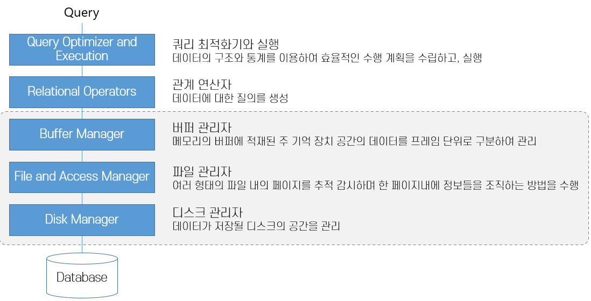

# 23.11.09(목) Module03 디스크와 파일

# 디스크와 파일

컴퓨터의 주기억 장치 → 레지스터, 메모리, 캐시메모리 등등

자바파일이 다운로드 되면 ?
→ 보조기억 장치에 저장이 된다.
프로그램이 실행이 되면 ?
→ 주기억 장치에 올라옴

마찬가지로 데이터가 저장이 되면 ?
→ 보조기억 장치에 저장이 된다.

| 사용자 | | | --- | --- | | Query Optimizer | 쿼리를 똥같이 짜도 이해해 줌??
Estimater로 관계 대수식으로 실행 관계를 산출한다.
| | Relational Operators | 실행 가능한 상태로 만들고 실행을 한다.
| | Buffer Manager | 여기는 디스크가 아닌 메모리에 있는 데이터를 사용하는 것

버퍼풀이라는 영역에서 | | Disk Manger | |

.DB Component

시스템 카탈로그

데이터를 몇 개를 가져오는가에 따라 성능에 차이가 있음?

RID LookUp

- Query Optimizer
- 관계 대수식?으로 연산을 한다.
- Buffer Manager
- 에 데이터가 없으면 File and Access Manager로 넘어간다.
- File and Access Manager

pre fatching → 평소에 내가 자주 사용하는 데이터를 메모리에 올려놓음

.Computer Storage Inheritance
image:images/2.ComputerStorageHire.png[ComputerStorageHire]

실제 동작은 1차 저장장치

데이터 저장은 2차 저장장치

백업은 3차 저장장치에

- 레지스터 종류 4가지 찾아보기
- 데이터 레지스터
- 주소 레지스터
- 부동소수점 레지스터
- 특수레지스터 (PC, Stack Pointer …)
- 캐시
- 메인 메모리
- 비휘발성 메모리 (USB, SSD 등)
- 하드디스크
- 광학디스크
- C, D 드라이브 등
- 자기 테이프

.Hard Disk

하드디스크 구조

- 직접 접근 방식이 아닌 순차 접근 방식.
- 기계 장치가 포함된 저장 장치로, 자기를 이용하여 데이터를 저장하고 읽음

하나의 파일이 연속된 블록에 저장되어 있는가 ?
→ X

.SSD

SSD(Solid State Drvie) 구조

플래시 메모리를 기반으로 한 저장 매체, Random Access 가능한 빠를ㄴ 속도의 저장 장치

모든 구성요소가 전기장치이며, 기계 장치를 가지지 않음

- 플래시 컨트롤러가 원하는 메모리 위치를 물어보고 원하는 데이터를 보내주면 끝난다 ?

HDD → 모터가 실제로 들어있어서 소리가 남, 탐색시간 + 회전 지연 시간 + 전송 시간 등이 걸린다.

SSD → 탐색 지연 시간, 회전 지연 시 등이 없음

### 버퍼풀 !!!!!!!!!!!!!!!!!! → 제일 중요한 내용

.Buffer Pool
image:images/5.BufferPool.png[BufferPool]

- 가용한 주 기억장치 공간을 페이지라는 단위로 분할한 데이터 적재 공간
- Estimater가 쿼리를 어떻게 하면 가장 효율적인가 ?
를 계산하고 만들어 낸다.

디스크에서 메모리에 프레임을 올리는 것 → 페이징한다.

페이지 폴트

WAL(Write Ahead Log)

부학장님 왈 → 데이터베이스는 무조건 스케일 데이터베이스 ~~~

데이터 베이스에서 가장 중요한 하드웨어 → 무조건 메모리

핀카운트 (피닝한다, 핀카운트한다.), dirty bit(오손 비트)

핀카운트가 1이라는 것은 누가 보고 있다.
== 교체 대상이 아니다.

dirty bit가 1이라는 것은 데이터가 변경이 됐다라는 것. → 1이면 로그에 무조건 쓴다.
(디스크와 메모리가 달라지는 것을 방지하기 위해서)

### 버퍼 교체 전략

- LRU(Least Recently Used) → Pin_count가 0인 프레임들에 대한 포인터로 큐를 생성
- Clock → 가장 많이 사용
- FIFO
- MRU(Most Recently Used) 가장 최근에 사용한
- Random
- 운영체제의 가상 메모리와 DBMS의 버퍼 관리자는 매우 비슷함

### 버퍼 관리 기법 비교

- 고정 길이 레코드

.Fixed Length Record

속도가 빠르지만, 정해진 양식에 따라야 한다.
→ 주민등록 번호, 등 정해진 양식일 때 사용하면 좋은 것.
(단, 핸드폰 번호는 변경이 됐으니 그런 사항들은 고민을 해봐야 한다.)

산술 연산에 유리하다.

- 가변 길이 레코드

.Variant Length Record

.Variant Length Record2

필드를 분리자로 구분하여 연속적으로 저장

속도가 느리지만 양식에 따를 필요가 없다.

텍스트 데이터 같은 경우에 유리하다.

### Heap 파일 (정렬을 하면서 넣으면 삽입과 삭제에 시간이 오래 걸리기 때문에 heap 선택)

- 가장 간단한 파일 구조로, 레코드가 파일의 빈 공간에 순서 없이 저장
- 페이지 내의 데이터가 어떠한 형태로도 정렬되지 않으며, 파일의 모든 레코드를 검색하면 다음 레코드를 되풀이해서 요청해야 함
- 파일의 레코드는 각기 유일한 rid를 가지며, 한 파일에 속하는 페이지는 크기가 모두 같음
- 파일의 생성(Create)과 제거(Destroy), 레코드의 삽입(Insert)과 rid를 통한 레코드 삭제(Delete), rid를 통한 레코드 선택(get), 파일 내의 모든 레코드 스캔(Scan) 연산 지원

### ISAM

- 인덱스를 직접 가지는 형태
- 속도가 어마어마하게 빠른데 오버플로우(중간 데이터를 삽입하기 위해 생기는 공간)가 생기는 순간 느려짐
- 극복하기 위해 B Tree를 쓰거나 B+ Tree를 사용한다.
B+ Tree를 사용하면 오버플로우가 안 생기기 때문에

### B+ 트리

- ISAM의 오버 플로의 단점을 개선한 동적 트리 자료구조
- 내부 노드들이 탐색 경로를 유도하고 단말 노드들이 데이터 엔트리를 가지는 균형 트리
- 트리에서 삽입, 삭제를 수행해도 트리의 균형이 유지됨
- 레코드를 탐색할 때 루트로부터 알맞은 단말 까지만 가면 됨
- 일반적으로 ISAM보다 우수한 구조

### 시스템 카탈로그

- 데이터베이스는 자신이 가지고 있는 모든 데이터에 대한 설명 정보를 저장함
- 관계형 데이터베이스 관리 시스템은 생성된 모든 릴레이션과 인덱스에 대한 정보를 유지 관리
- 시스템 카탈로그(System Catalog), 전역 데이터 베이스, 데이터 사전(Data Dictionary), 마스터 데이터베이스(Master Database), 메타데이터(Metadata)라고도 부름

오늘 가장 중요한 내용은 버퍼풀!

# Module 04: 파일 조직과 인덱스

- 비용 측정
- 데이터 페이지의 개수 B, 페이지에 속한 레코드의 개수 R, 디스크 페이지를 하나를 읽는 시간을 D로 가정
- 디스크 페이지 하나를 쓰는데 걸리는 평균 시간 D, 한 레코드를 처리하는데 걸리는 시간 C
- 한 레코드에 해시 함수를 적용하는데 걸리는 시간 H

### 힙파일

- 스캔 → B(D+RC)
- 동등 → 셀렉션 후보 키에 대한 연산일 경우 → 0.5B(D+RC).
후보키가 아닌 경우 스캔과 동일
- 범위 → 셀렉션 스캔과 동일
- 삽입 → 레코드가 항상 파일의 끝에 삽입된다고 가정할 겨우 2D+C
- 삭제 → 탐색 비용 + C + D

제일 유리한 경우 == 삽입할 때

### 정렬 파일

ISAM, B+ Tree etc..

- 특정 필드를 기준으로 정렬된 파일
- 스캔

    힙 파일과 다르지 않음. B(D+RC)

- 동등 셀렉션

    정럴 기준 필드로 검색할 경우 이진 탐색으로 *Dlog2B* + *Clog2R*. 정렬 필드가 아닌 경우 스캔과 동일

- 범위 셀렉션

    정렬 기준 필드로 검색할 경우 첫 레코드를 찾는데 동등 셀렉션과 동일. 이후 범위내 스캔

- 삽입

    정렬 순서를 유지하기 위해 레코드가 삽입될 위치를 검색 후 레코드 추가. 후속 페이지를 모두 로드하여 다시 저장. 탐색 비용 + B(D + RC)

### 해시 파일

- 특정 필드를 기준으로 정렬된 파일
- 스캔

    힙 파일과 다르지 않음. B(D+RC)

- 동등 셀렉션

    정럴 기준 필드로 검색할 경우 이진 탐색으로 Dlog2B + Clog2R. 정렬 필드가 아닌 경우 스캔과 동일

- 범위 셀렉션

    정렬 기준 필드로 검색할 경우 첫 레코드를 찾는데 동등 셀렉션과 동일. 이후 범위내 스캔

- 삽입

    정렬 순서를 유지하기 위해 레코드가 삽입될 위치를 검색 후 레코드 추가. 후속 페이지를 모두 로드하여 다시 저장. 탐색 비용 + B(D + RC)

.Hash Heap Sorted
image:images/9.HashHeapSorted.png[HashHeapSorted]

검은 색이 가장 효과가 좋은 것

범용적으로 가장 괜찮은 것은 정렬 파일이 효과적이다.

정렬 파일에서 삽입이나 삭제의 효율을 높이는 방법에 대한 아이디어 → 데이터를 듬성 듬성 삽입하는 것 (데이터를 재조정할 필요 없게 만들기 위해서)

- 힙 파일은 저장 성능이 우수하고 스캔, 삽입, 삭제 연산이 빠르지만 탐색은 느립니다.
- 정렬 파일은 저장 성능이 우수하고, 삽입과 삭제 연산이 느리지만 탐색은 대단히 빠릅니다.
- 해시 파일은 저장 성능이 떨어지지만, 삽입과 삭제가 빠르며 동등 탐색에서 대단히 우수합니다.
하지만 범위 탐색은 지원하지 못하며 스캔 성능이 떨어집니다.

### 인덱스

- 해당 파일의 기본적인 레코드 조직법으로는 효율적으로 지원되지 않는 **(검색)연산의 속도를 높이기 위해 만드는 보조적인 자료구조**
- 데이터 엔트리(Data Entry)들의 모임
- 클러스터, 논클러스터 인덱스
- 밀집 인덱스(Dense index) → 파일에 있는 모든 탐색 키 값에 대해 데이터 엔트리를 구성
- 희소 인덱스(Sparse Index) → 데이터 파일의 페이지 별로 하나의 데이터 엔트리를 구성
- 데이터가 적을 때는 인덱스 없이 바로 Scan 하는게 빠르고, 약 10만개 이상 정도만 돼도 인덱스를 따로 생성하는 것이 훨씬 빠르다.

# 이번주 숙제 → 회원용 게시판 만들기

회원이면 게시판에 글을 쓸 수 있다.

데이터 삽입도 해보기

어디에 인덱스를 걸어야 잘 걸었다고 소문이 날지에 대해.

운영자가 게시판을 자유롭게 생성할 수 있는

…