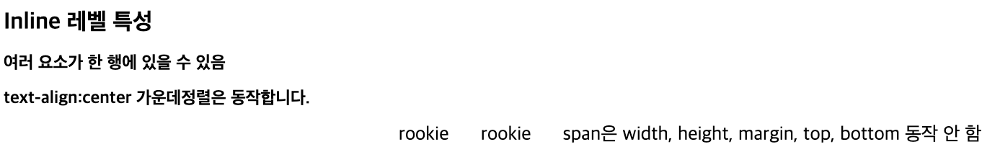
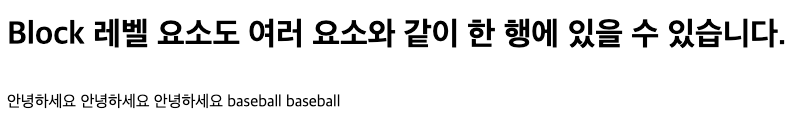
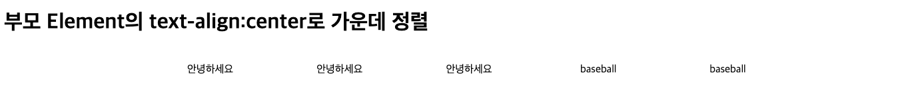
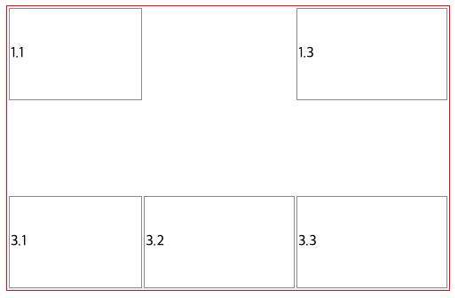
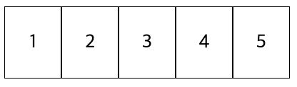
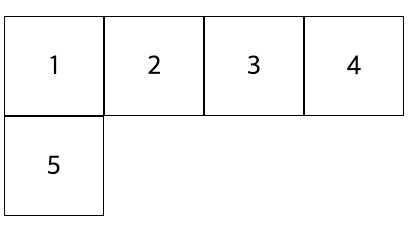
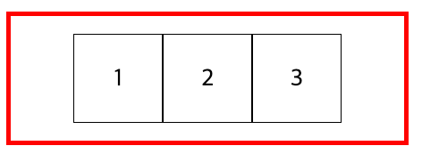

== 23.11.23(목) CSS Display

=== 한 라인을 모두 차지

[source,html]
----

안녕하세요

안녕하세요

안녕하세요

----

* width, height, margin, padding

[source,css]
----
p {
    margin: 10px;
    padding: 10px;
    width: 150px;
    height: 30px;
    background-color: azure;
}
----

* margin: \{number} auto;

[source,css]
----
p {
    margin: 0 auto;
    width: 150px;
    background-color: azure;
}
----

=== Inline Level

* 여러 요소가 한 행에 있음
* width, height, margin, top, bottom은 동작하지 않는다 ?

[source,html]
----

    rookie
    rookie
    span은 width, height, margin, top, bottom 동작 안 함

----

.Inline level

=== Inline Block

* Block Level 요소도 여러 요소와 같이 한 행에 있을 수 있다.

[source,html]
----

안녕하세요

안녕하세요

안녕하세요

baseball
baseball
----

.Inline block

==== Inline level 요소도 width, height, margin, padding을 모두 가질 수 있다.

[source,html]
----

    
안녕하세요

    
안녕하세요

    
안녕하세요

    baseball
    baseball

----

.Inline

==== display:none

* 해당 element를 화면에서 보이지 않게 함

[source,html]
----

----

==== visibilty:hidden

* displa:none과 비슷하지만 공간을 차지하는 특성이 있다.

[source,html]
----

<table>
    <tr>
        <td>1.1</td>
        <td class="td_hidden">1.2</td>
        <td>1.3</td>
    </tr>
    <tr class="td_hidden">
        <td>2.1</td>
        <td>2.2</td>
        <td>2.3</td>
    </tr>
    <tr>
        <td>3.1</td>
        <td>3.2</td>
        <td>3.3</td>
    </tr>
</table>
----

.Visibility

==== flexible 박스

* 유연하게 조정한다는 뜻의 새로운 display 속성
* HTML5에서 추가 - 모든 모던 브라우저에서 지원
* flexbox는 부모 요소인 container와 자식요소인 flex item으로 구성됩니다.

[source,css]
----
flex-direction:row ( default ) , 가로방향+
flex-direction:column , 세로방향
----

[source,html]
----

    

    

    

    

    

    

----

* flex:\{숫자} : 숫자 비율만큼 공간 차지
* 공간을 배치한 후에 남는 공간을 유동적으로 조절 가능
* flex:2 의미?
** *증가너비(flex-grow), 감소너비(flex-shrink), 기본너비(flex-basis)를 한꺼번에 나타내는 단축 속성*
* nth-child란?
** 형제 사이에서의 순서에 따라 요소를 선택합니다.

[source,html]
----

    
flex:2

    
flex:1

    
flex:1

----

* flex : none - 원래 지정된 공간을 차지
* flex : \{숫자} - 나머지 공간을 다시 비율로 나눠서 차지

[source,html]
----

    
flex:2

    
flex:1

    
flex:1

----

* 원래 지정된 공간을 차지 즉 flex item 크기가 커지거나 작어지지 않습니다.
* 또한 flex container의 크기에 영향을 받지 않습니다.
* flex item의 원래 크기를 유지합니다.
* flex item3을 제외한 item1,item2을 기준으로 2:1 비율을 나눠서 차지 합니다.
* flex-wrap: nowrap;
** 행의 줄 바꿈을 하지 않습니다.
한 줄로 표시합니다.
** `container width = 400px;`
** `chlid width = 100px * 5 = 500px;`

[source,html]
----

    
1

    
2

    
3

    
4

    
5

----

.Flex no-wrap

* flex:wrap
** flex 아이템이 flex 컨테이너 안에서 표시되도록, 줄 바꿈합니다.
** *container width = 400px;*
** *chlid width = 100px * 5 = 500px;*

.Flex wrap

==== flex 정렬

수평정렬

[source,html]
----

    
1

    
2

    
3

----

.Flex content

수직정렬

[source,html]
----

    
1

    
2

    
3

----

.Flex content

=== Overflow

==== Overflow:visible;

* 박스가 넘어가도 넘어간 채로 출력

==== Overflow:hidden;

* 부모 Element를 넘어 가는 값을 잘라냄

==== Overflow: scroll;

* 가로 세로 스크롤바를 항상 보여줌

==== Overflow:auto;

* 내용이 넘치는 경우에만 스크롤바를 보여줌

==== text-overflow:ellipsis;

* 텍스트가 부모 요소를 벗어났을 때 말 줄임 표시를 위해 사용

[source,html]
----

<h1>Overflow:visible; default</h1>

    

        overflow CSS 단축 속성은 요소의 콘텐츠가 너무 커서 요소의 블록 서식 맥락에 맞출 수 없을 때의 처리법을 지정합니다. overflow-x, overflow-y
    

<h1>Overflow:hidden;</h1>
<h2>hidden -> 부모 Element를 넘어 가는 값을 잘라 냄</h2>

    

        overflow CSS 단축 속성은 요소의 콘텐츠가 너무 커서 요소의 블록 서식 맥락에 맞출 수 없을 때의 처리법을 지정합니다. overflow-x, overflow-y
    

<h1>Overflow:scroll;</h1>
<h2>scroll -> 가로 세로 스크롤 바를 항상 보여줌</h2>

    

        overflow CSS 단축 속성은 요소의 콘텐츠가 너무 커서 요소의 블록 서식 맥락에 맞출 수 없을 때의 처리법을 지정합니다. overflow-x, overflow-y
    

<h1>Overflow:auto;</h1>
<h2>auto -> 내용이 넘치는 경우에만 스크롤바를 보여 줌</h2>

<h1>text-overflow:ellipsis;</h1>
<h2>텍스트가 부모 요소를 벗어났을 때 말 줄임 표시를 위해 사용</h2>

    overflow CSS 단축 속성은 요소의 콘텐츠가 너무 커서 요소의 블록 서식 맥락에 맞출 수 없을 때의 처리법을 지정합니다. overflow-x, overflow-y

----

=== z-index

* 요소의 순서 설정
* 어떤 Element가 가장 위로 올라갈 것인지 결정

[source,html]
----

    
z-index: 2

    
z-index: 3

    
z-index: 4

----

=== Font

* 글자에 적용할 수 있는 속성

[cols=",,",options="header",]
|===
|속성 |설명 |값
|font-style |글자 스타일 |Normal
|italic |oblique |font-weight
|글자 굵기 |Lighter |normal
|bold |border |1 ~ 100
|font-size |글자 크기 |
|font-family |글꼴 |글꼴 이름
|line-height |기본 글꼴의 상대적인 크기 |normal
|===

* 글자 크기 표현 단위

[cols=",",options="header",]
|===
|단위 |설명
|px |화소 단위
|em |부모 요소의 글자 크기 기준 배율
|rem |HTML 글자 크기 기준 배율
|pt |글꼴에 많이 쓰임
|% |기본 글꼴의 상대적인 크기
|vw,vh |뷰포트 기준 너비, 높이
|===

[source,css]
----
div {
    font-style: italic;
    font-weight: bold;
    font-size: .8em;
    line-height: 1.2;
    font-family: Arial, Helvetica, sans-serif;
}

or

div {
    font: italic bold .8em/1.2 Arial, Helvetica,
    sans-serif;
}
----

…
