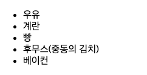
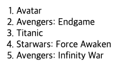
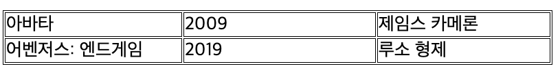
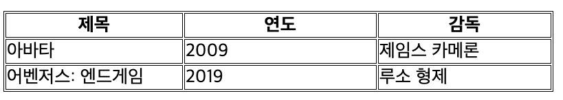
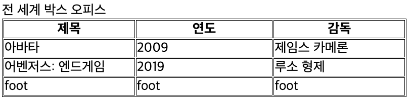
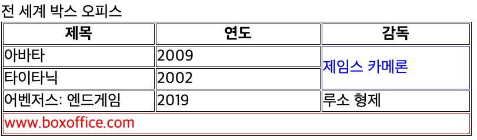
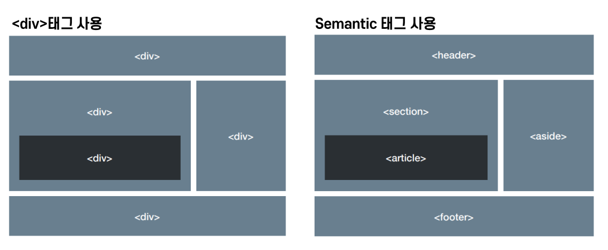

= 23.11.22(수) HTML

== 태그

=== Inline Tag

* 자신의 내용과 앞 뒤 태그의 내용을 같은 라인에 출력하는 태그
* 대표적인 태그는
* 반드시 알아야 할 태그

[source,html]
----
, <a>,  
,<button>,,<input>,<select>,<textarea>,<label>,<strong>
<abbr>, <acronym>, <b>, <bdo>, <big>, <cite>, <code>, <dfn>, <em>, <i>, <kbd>,<map>, <object>, <q>, <samp>, <small>, <script>,, ,<tt>, <var>
----

=== Block Tag

* 자신의 내용과 앞뒤 태그의 내용을 다른 라인에 출력하는 태그(즉 좌우 너비가 100%)
* 주로 구조를 만들 때 사용
* 대표적인 태그는
+
* 반드시 알아야 할 태그

[source,html]
----
<form>, <ul>, 
, <table>, 
,<address>
<h1>,<h2>, <h3>, <h4>, <h5>, <h6>
<article>, <aside>, <audio>, <blockquote>, <canvas>, <dd>, <dl>, <fieldset>, <figcaption>, <figure>, <footer>,
<header>, <hgroup>, 
, <noscript>, <ol>, <output>, <pre>, <section>, <video>
----

=== 영역을 나누는 태그

* division의 약자, 웹 사이트의 레이아웃을 만들 때 사용하는 태그
* 웹 페이지에서 논리적 구분을 정의
* 각각의 블록(공간)을 알맞게 배치하고 CSS 스타일 적용
* Block level element

* 자체만으로 어떠한 의미도 가지지 않는다.
* class, id의 전역 속성으로 스타일링을 위해 요솓르을 그룹화
* Inline level element

=== 내용을 표현하는 태그

~

== 계층구조

### 순서 없는 목록:

,

[source,html]
----
<ul>
    <li>우유</li>
    <li>계란</li>
    <li>빵</li>
    <li>후무스(중동의 김치)</li>
    <li>베이컨</li>
</ul>
----

.List

### 순서 있는 목록 : ,

[source,html]
----
<ol>
    <li>Avatar</li>
    <li>Avengers: Endgame</li>
    <li>Titanic</li>
    <li>Starwars: Force Awaken</li>
    <li>Avengers: Infinity War</li>
</ol>
----

.순서대로 나열된 List

=== 중요와 강조 - 글자 모양 변경하는데 사용 등등

[source,html]
----
<em></em> or <i></i> <!-- 기울기 -->

<strong></strong> or <b></b> <!-- 글자 굵게(bold) -->

<u></u> <!-- 밑줄 -->

<blockquote></blockquote> <!-- 인용구 -->

 <!-- 제곱이나 25th(주년) 같은 거 사용할 때 사용하는 위 첨자 -->

 <!-- 화학식 등에 들어가는 아래 첨자 -->

<address></address> <!-- 해당 문서의 연락 정보. 이탤릭체로 표현 -->

폰 노이만의
  <cite><a href="https://en.wikipedia.org/wiki/Von_Neumann_architecture" target="_blank" >컴퓨터 구조</a></cite>에 따르면,

<!-- 출처 -->

<abbr title = "Hypertext Markup Language">HTML</abbr> <!-- 약어 -->

<var></var> <!-- 변수 이름을 특별하게 표시(프로그래밍 또는 수학적 표현에서 변수를 정의하는 데 사용) -->

Select all the text with <kbd>Ctrl</kbd>/<kbd>Cmd</kbd> + <kbd>A</kbd>.

<pre>$ <kbd>ping mozilla.org</kbd></pre>
<!-- 컴퓨터에 입력된 키보드 입력을 표시 -->

<samp></samp> <!-- 컴퓨터 프로그램의 출력을 표시(?) -->
----

=== 시간 표현

* 기본 문법
** YYYY : 2022 / 년
** MM : 09 / 월
** DD : 22 / 일
** hh : 19 / 시
** mm : 06 / 분
** ss : 15 / 초

[source,html]
----
<!-- 기계가 읽을 수 있는 명확한 시간/날짜 첨부 -->
<!-- Standard simple date -->

<time datetime="2016-01-20">20 January 2016</time> <!-- Just year and month -->

<time datetime="2016-01">January 2016</time>

<!-- Just month and day -->

<time datetime="01-20">20 January</time>

<!-- Just time, hours and minutes -->

<time datetime="19:30">19:30</time>

<!-- You can do seconds and milliseconds too! --> <time datetime="19:30:01.856">19:30:01.856</time> <!-- Date and time -->

<time datetime="2016-01-20T19:30">7.30pm, 20 January 2016</time>

<!-- Date and time with timezone offset-->

<time datetime="2016-01-20T19:30+01:00">7.30pm, 20 January 2016 is 8.30pm in France</time>

<!-- Calling out a specific week number-->

<time datetime="2016-W04">The fourth week of 2016</time>

----

== 링크

* HTML 파일, 텍스트 파일, 이미지, 문서, 비디오와 오디오 파일 등 웹 상에 존재할 수 있는 모든 것을 연결****

[source,html]
----
<a href="링크할 주소">텍스트 또는 이미지</a>

<!-- local에서 이미지 참조해서 링크 걸기 -->

<!-- remote에서 이미지 참조해서 링크 걸기 -->

메일을 보내시려면 <a href="mailto:marco@nhnacademy.com">이쪽</a>으로 보내주세요

<!-- emain 링크 -->
----

== 이미지

=== img tag로 image 삽입

[source,html]
----

<!-- 이미지 크기 조정 -->

----

== 테이블

* {blank}
+
+
태그로 테이블을 시작
* {blank}
+
+
태그로 테이블을 시작
* {blank}
+
+
태그로 행을 만듦
* **
+
+
태그는 셀의 문자를 가운데 굵게 표시(제목에 사용)**

[source,html]
----
<table border="1">
    <tr>
        <td>아바타</td> <td>2009</td> <td>제임스 카메론</td>
    </tr>
    <tr>
        <td>어벤저스: 엔드게임</td> <td>2019</td>
        <td>루소 형제</td>
    </tr>
</table>
----

.Table 예시1

[source,html]
----
<table border="1">
    <thread>
        <tr>
            <th>제목</th>
            <th>연도</th>
            <th>감독</th>
        </tr>
    </thead>

    <tr>
        <td>아바타</td>
        <td>2009</td>
        <td>제임스 카메론</td>
    </tr>
    <tr>
        <td>어벤저스: 엔드게임</td>
        <td>2019</td>
        <td>루소 형제</td>
    </tr>
</table>
----

.Table 예시2

[source,html]
----

<table>
    <catpion>전 세계 박스 오피스</catpion>
    <thead>
        <tr>
            <th>제목</th>
            <th>연도</th>
            <th>감독</th>
        </tr>
    </thead>
    <tbody>
        <tr>
            <td>아바타</td>
            <td>2009</td>
            <td>제임스 카메론</td>
        </tr>
        <tr>
            <td>어벤저스: 엔드게임</td>
            <td>2019</td>
            <td>루소 형제</td>
        </tr>
    </tbody>
    <tfoot>
        <tr>
            <td>foot</td>
            <td>foot</td>
            <td>foot</td>
        </tr>
    </tfoot>
</table>
----

.Table 예시3

[source,html]
----

<table>
    <catpion>전 세계 박스 오피스</catpion>
    <thead>
        <tr>
            <th>제목</th>
            <th>연도</th>
            <th>감독</th>
        </tr>
    </thead>
    <tbody>
        <tr>
            <td>아바타</td>
            <td>2009</td>
            <td rowspan="2" class="border-blue">제임스 카메론</td>
        </tr>
        <tr>
            <td>타이타닉</td>
            <td>2002</td>
        </tr>
        <tr>
            <td>어벤저스: 엔드게임</td>
            <td>2019</td>
            <td>루소 형제</td>
        </tr>
    </tbody>
    <tfoot>
        <tr>
            <td colspan="3" class="border-red">www.boxoffice.com</td>
        </tr>
    </tfoot>
</table>
----

.Table 예시4

== Semantic tags

의미없는

태그의 사용보다 문서의 내용을 쉽게 이해할 수 있도록 의미를 가지는 새로운 태그

.Semantic tag

=== Semantic Elements

[width="100%",cols="50%,50%",options="header",]
|===
|Tag명 |설명
|main |문서의 주요 콘텐츠를 포함, 문서 내에 단 하나만 존재

|header |문서 소개나 탐색을 돕는 요소들의 그룹

|nav |현재 페이지 내, 또는 다른 페이지로의 링크

|aside |주요 내용과 간접적으로만 연관된 부분

|section |문서의 일반적인 구획, 여러 줌심 내용을 감싸는 공간

|footer |문서의 아래쪽 작성자 구획, 저작권 데이터, 관련된 문서의 링크에
대한 정보

|figure |문서의 멀티미디어 요소

|article |글자가 많이 들어가는 부분(그 자체로 독립적으로 구분되거나
재사용 가능한 영역)
|===

== 응답코드(발생할 수 있는 오류들)

=== 1XX

* 정보 전달 : 요청을 받았고, 작업을 진행 중이라는 의미 웹 socket 쪽에서 사용하고 있음

=== 2XX

* 성공 : 작업을 성공적으로 받았고, 이해했으며, 받아들여졌다는 의미
* *200*
** OK
** 성공적으로 처리했을 때 쓰인다.
가장 일반적으로 볼 수 있는 HTTP 상태
* *201*
** Created
** 요청이 성공적으로 처리되어 리소스가 만들어졌음을 의미
* 202
** Accepted
** 요청이 받아들여졌지만 처리되지 않았음을 의미
* 203
** Non-Authoritaive Information : 응답받은 메타정보가 서버에 저장된 원본하고는 동일하지는 않지만 로컬이나 다른 복사본에서 수집되었을을 알리는 응답코드
* 204
** No Content
** 성공적으로 처리했지만 컨텐츠를 제공하지 않는다.

=== 3XX

* 요청을 완료하기 위해서는 리다이렉션이 이루어져야 한다는 의미 *
** Moved Permanently
** 영구적으로 컨텐츠가 이동했을 때 사용된다.
*
** Found
** 일시적으로 컨텐츠가 이동했을때 사용된다.

=== 4XX

* 클라이언트 오류, 이 요청은 올바르지 않다는 의미.
* *400*
** Bad Request
** 요청 자체가 잘못되었을 때 사용하는 코드
* *401*
** Unauthorized
** 권한 없음
** 인증이 필요한 리소스에 인증 없이 접근할 경우 발생합니다.
* *403*
** Forbidden
** 서버가 요청을 거부할 때 발생한다.
* *404*
** Not Found
** 찿는 리소스가 없다는 의미, 가장 흔하게 볼 수 있는 오류코드
* *405*
** Method not allowed
** 요청은 정상이나 서버에서 받아들일 수 없는 요청일때 사용하는 코드.
** ex) 서버는 POST 요청 <– client에서 get으로 요청할 경우 해당 mehtod 서버에서 받아드리지 않음.

=== 5XX

* 서버 오류 : 서버가 응답할 수 없다는 의미, 요청이 올바른지의 여부는 알 수 없음.
* *500*
** Internal Server Error
** 내부 서버오류
* 501
** Not Implemented
** 요청한 기능 미지원
* 502
** Bad Gateway
** 게이트웨이가 연결된 서버로부터 잘못된 응답을 받았을 때 사용된다.
* 503
** Service Temporally Unavailable
** 일시적으로 서비스를 이용할 수 없음
* 504
** Gateway Timeout
** 게이트웨이가 연결된 서버로부터 응답을 받을 수 없을 때 사용된다.

…
